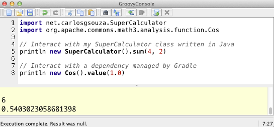

gradle-console
============
This plugin for [Gradle](http://www.gradle.org/) allows you to easily interact with your Groovy and Java applications using the [Groovy Console](http://groovy.codehaus.org/Groovy+Console).



Just run <code>gradle console</code> and you will get a console window with all your runtime dependencies loaded for you. This is useful in case you need to interact your project dependencies or your source code in a fast and flexible way.


## Installation
Add one of the following snippets to your build.gradle file according to the version of Gradle you are using:
### Gradle >= 2.1
```groovy
plugins {
	id "net.carlosgsouza.console" version "1.0.1"
}
```

### Gradle < 2.1
```groovy
buildscript {
    repositories {
        jcenter()
    }
    dependencies {
        classpath group: 'net.carlosgsouza', name: 'gradle-console', version: '1.0.1'
    }
}
apply plugin: 'console'
```

## Usage
Invoke the <code>console</code> task using gradle

```
gradle console
```

## About this project
This is just the first version of this plugin and we are counting on your feedback to make it better!
Don't hesitate to send us an e-mail, create an issue on GitHub or, even better, submit a pull request. 

## Acknowledgement
This plugin was created based on [this post](http://piraguaconsulting.blogspot.com.br/2012/02/gradle-groovy-console.html) by Mike Hugo. Thanks, Mike!
